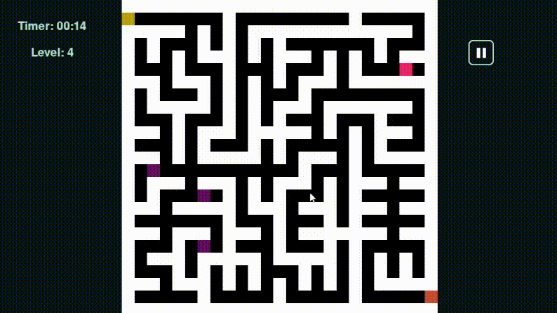
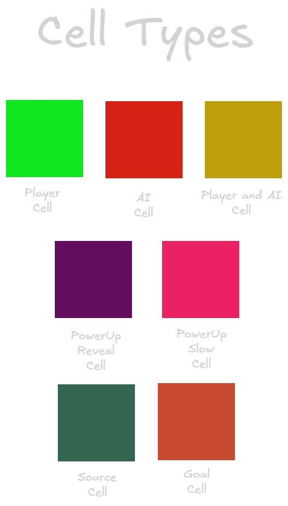
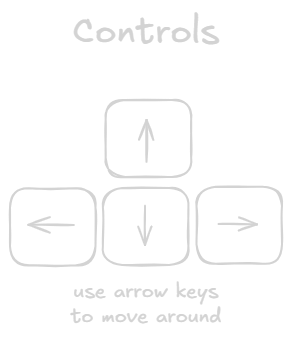

# Memory Maze - Human vs AI Pathfinding Game

_Memory Maze - Human vs AI Pathfinding Game_ aims to develop a competitive maze-solving game where a human player competes against an AI rival. At the beginning, the maze is displayed fully for a few seconds, after which parts of it disappear. The player must rely on memory and strategy to find the exit. Simultaneously, the AI rival uses the `A*` Search Algorithm (`Manhattan Distance heuristic`) to navigate the maze efficiently.

## Requirements

- `Python 3.13.0+` and `PyGame` are installed on the machine.

## How to run

### Download

1. Download the source code from [releases](https://github.com/ChuzaWick420/FYP_AI_Based_Puzzle_Game/releases).
2. Extracted into your desired directory.
3. Open terminal into the game directory or use `cd` command to change directory to the game directory.
4. Enter the command: `python ./main.py`

### Git

1. Clone the source code into desired directory. (i.e. run this command: `git clone https://github.com/ChuzaWick420/FYP_AI_Based_Puzzle_Game Memory_Maze`)
2. Open terminal into the game directory or use `cd` command to change directory to the game directory.
3. Enter the command: `python ./main.py`

## Game

### Gameplay

### Cell Types

### Controls

