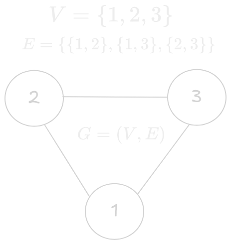

# Graph in Discrete Mathematics

A `graph` is a pair $G = (V, E)$ where $V$ is the `set` of all `vertices` (or `nodes`) of the `graph` and $E$ is the `set` of all edges of the `graph`. [^1] 

## Edge
An `edge` is an `unordered pair` of two `vertices` or `nodes`.

## Visual Aid

    

## References
[^1]: [Wikipedia](https://en.wikipedia.org/wiki/Graph_(discrete_mathematics)#Graph)
